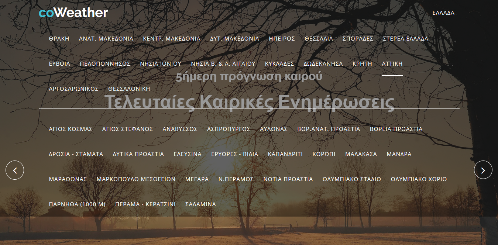
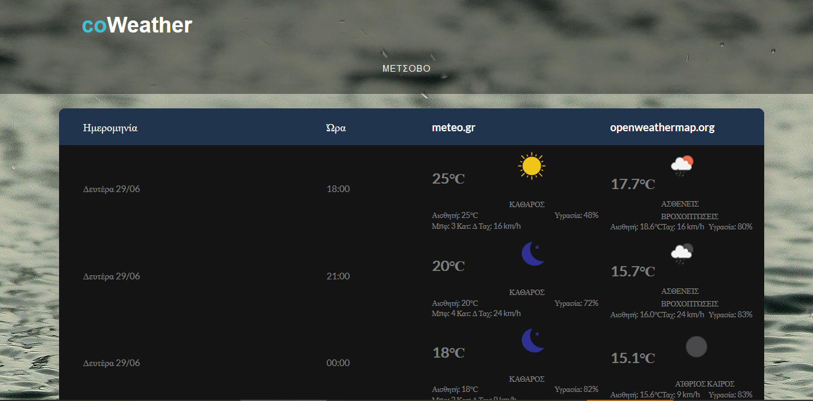

# CoWeather

A weather site for greek forecasts hosted online on heroku server at [coweather.herokuapp.com](http://coweather.herokuapp.com). CoWeather pulls weather forecasts from meteo.gr using web-scraping and from openweathermap.org using API requests.

## Screenshots
- index page

- index with menu 

- weather forecast page

## Tools
 - Back-end
    - [Django Python Framework](https://www.djangoproject.com/)  to build the Web app
    - [Beautiful Soup](https://www.crummy.com/software/BeautifulSoup/bs4/doc/) a Python library to pulling data from meteo.gr
 - Front-end
    - HTML
    - CSS
    - Javascript
- Database
    - SQLite

## Authors

* **Schoinochoritis Ioannis** 

